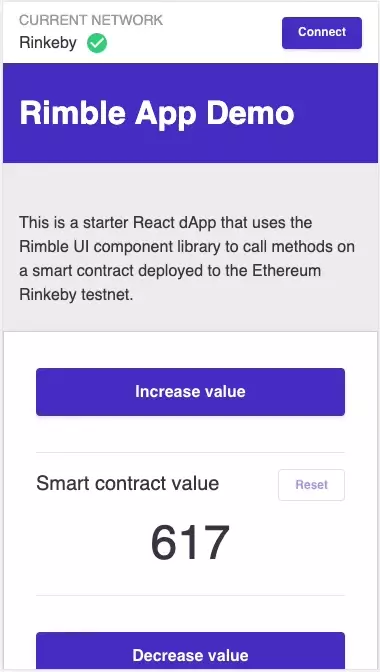

# Rimble Demo App

This is a React dApp that uses the Rimble UI component library and Rimble Web3 Components to walk a new user through connecting, verifying and transacting with a smart contract deployed to the Ethereum Rinkeby testnet.

[Live Demo](https://rimble-app-demo.netlify.com/)

## Overview

- Implements Rimble UI, a dApp-first design system for faster dApp development
- Integrates Rimble Web3 Components with web3 provider for better dApp UX
- Wraps common web3 functions for consumption by React components

### Requirements

- [node 9+](https://nodejs.org/en/)
- [git](https://git-scm.com/downloads)
- [yarn](https://yarnpkg.com/en/docs/install)

## Quick start

Clone the repo

```bash
git clone https://github.com/ConsenSys/rimble-app-demo
```

Change directories

```bash
cd rimble-toast-demo
```

Install dependencies

```bash
yarn install
```

Start local server

```bash
yarn start
```

Navigate to http://localhost:3000 in your browser

### Modifying smart contract

The smart contract address and the application binary interface (ABI) for the contract are both in the `SmartContractCard.js` file. Update these constants with your own smart contract details.

### Calling methods

The `RimbleWeb3.js` component passes a proper for the `web3.eth.contract.send` method and only needs the smart contract's method name.

### Onboarding Flow

The dApp demonstrates an informative, tested, and effective UI to get user's connected to your app and interacting with minimal frustration. The dApp addresses these scenarios:

- Not on a web3-capable browser
- No MetaMask (web3) extension available
- Connected to wrong Ethereum network
- EIP 1102 Connection request (with graceful fallback)
- Personal signature request of specialized nonce to ensure connection with wallet's owner
- Helper modals for low funds and instructions to acquire ETH
- Transaction-initiated modals that will connect, verify, and check funds with 1 click
- Polling for account changes and balance updates

[View full onboarding flow](https://whimsical.com/AEj6t36cCytKBciCzT8WoL)

### Customize toast message content

You can customize the toast message content. See Rimble's content guidance for writing toast messages.
[Read content guidance](https://consensys.github.io/rimble-ui/?selectedKind=ToastMessage&selectedStory=ToastMessage&full=0&addons=1&stories=1&panelRight=0&addonPanel=storybook%2Factions%2Factions-panel)

### Lifecycle states

This is meant to enhance the existing web3 states and show relevant transaction detail to the user to monitor the progress of the transaction.

- Start
- Pending
- First confirmation
- Success
- Failure

## Resources

- [Create React App documentation](https://facebook.github.io/create-react-app/docs/getting-started).
- [web3.js documentation (0.2x.x)](https://github.com/ethereum/wiki/wiki/JavaScript-API)
- [About Rimble UI](https://rimble.consensys.design/)
- [Remix IDE for deploying smart contracts](https://remix.ethereum.org/)
