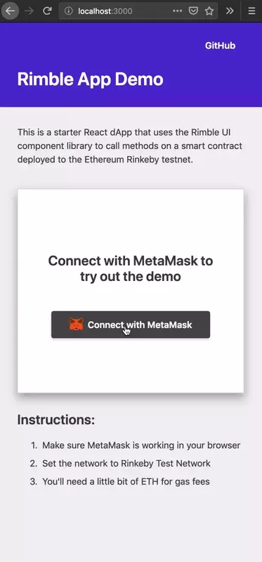

# Rimble toast demo

This is a starter React dApp that uses the Rimble UI component library to call methods on a smart contract deployed to the Ethereum Rinkeby testnet.

[Live Demo](https://consensys.github.io/rimble-app-demo)

## Instant start

[](https://codesandbox.io/s/github/ConsenSys/rimble-app-demo)

## Overview

- Implements a web3 component library (Rimble UI)
- Wraps common web3 functions for consumption by React components
- Integrates Rimble UI web3 components with web3 provider

### Requirements

- [node 9+](https://nodejs.org/en/)
- [git](https://git-scm.com/downloads)
- [yarn](https://yarnpkg.com/en/docs/install)

## Quick start

Clone the repo

```bash
git clone https://github.com/ConsenSys/rimble-app-demo
```

Change directories

```bash
cd rimble-toast-demo
```

Install dependencies

```bash
yarn install
```

Start local server

```bash
yarn develop
```

Navigate to http://localhost:3000 in your browser

### Modifying smart contract

The smart contract address and the application binary interface (ABI) for the contract are both in the `SmartContractCard.js` file. Update these constants with your own smart contract details.

### Calling methods

The `RimbleWeb3.js` component passes a proper for the `web3.eth.contract.send` method and only needs the smart contract's method name.

### Customize toast message content

You can customize the toast message content. See Rimble's content guidance for writing toast messages.
[Read content guidance](https://consensys.github.io/rimble-ui/?selectedKind=ToastMessage&selectedStory=ToastMessage&full=0&addons=1&stories=1&panelRight=0&addonPanel=storybook%2Factions%2Factions-panel)

### Lifecycle states

This is meant to enhance the existing web3 states and show relevant transaction detail to the user to monitor the progress of the transaction.

- Start
- Pending
- First confirmation
- Success
- Failure

## Resources

- [Create React App documentation](https://facebook.github.io/create-react-app/docs/getting-started).
- [web3.js documentation (0.2x.x)](https://github.com/ethereum/wiki/wiki/JavaScript-API)
- [About Rimble UI](https://rimble.consensys.design/)
- [Remix IDE for deploying smart contracts](https://remix.ethereum.org/)
